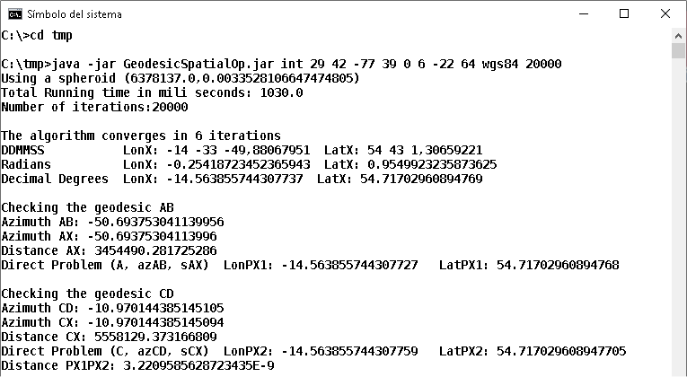
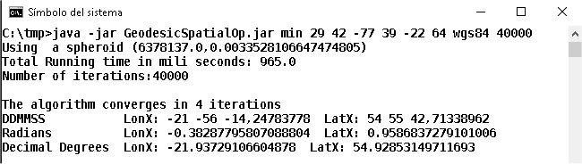
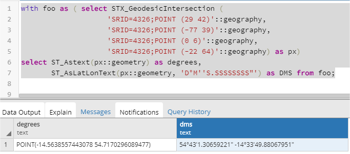
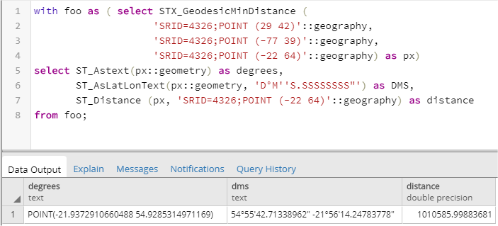

# Geodesic Spatial Operators on the ellipsoid
Two implementations (in Java and PlpgSQL for PostGIS) to obtain the intersection of two geodesic lines and the minimun distance from a point to a geodesic line with a high accuracy (better than 100nm), supporting long distances (greater than 180 degrees).

The research is published in this paper: (write the paper reference when it is published). The directory <i>journal_data</i> contains all the data from the tests and results calculated for the paper.

-	We prove that the most powerful spatial analysis software products (from Oracle DBMS, Google, ESRI, etc.) make large errors when performing some spatial operators on the spheroid.
-	We prove that these errors range from centimeters to hundreds of meters.
-	We have designed and implemented (in a spatial database) two algorithms that calculate these spatial operators on the spheroid with high accuracy.
-	We prove that the accuracy of these new spatial operators working on the spheroid are better than 100 nm.
-	You do not have to worry anymore about choosing the best-fit local projection to analysis your spatial data.

The file <i>GeodesicSpatialOp.Java</i> contains the Java implementation, and the file <i>GeodesicSpatialOp.sql</i> the Pl/pgSQL implementation for PostGIS.

You can try the geodesic intersection with the Java implementation <i>GeodesicIntersection.jar</i> from a shell like (20000 executions per second in a Core i7 4771 processor):

  

and the minimum distance from a point to a geodesic line with (40000 executions per second):

  

To use the new spatial operators with PostGIS, run the file <i>src/GeodesicSpatialOp.sql</i> in a PostGIS database.
The SQL method <i>STX_GeodesicIntersection</i> returns the intersection point of the two geodesics in PostGIS:

  

The SQL method <i>STX_GeodesicMinDistance</i> returns the closest point on the geodesic to a third point:

  

